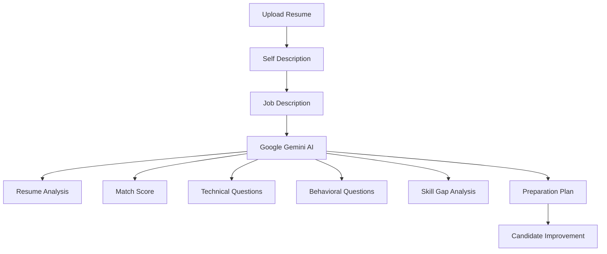
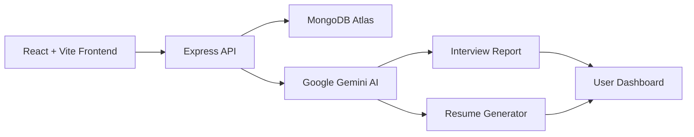
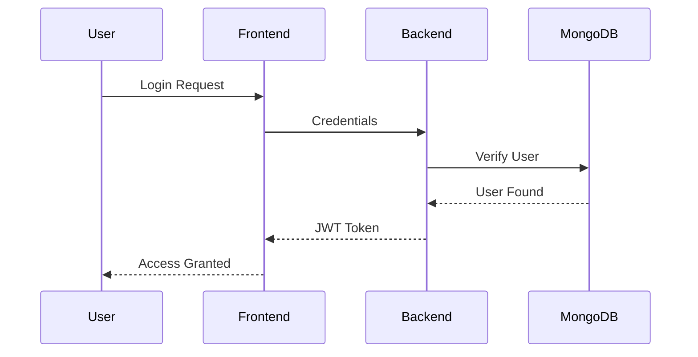

<div align="center">

# 🚀 SmartPrep

### AI-Powered Interview Preparation Platform


<br>

<p align="center">


</p>

<p align="center">


</p>

</div>

---

# 🌟 Overview

SmartPrep is an **AI-Powered Interview Preparation Platform** designed to help job seekers improve their interview readiness through intelligent resume analysis, job matching, interview question generation, skill-gap detection, and personalized preparation roadmaps.

The platform leverages **Google Gemini AI** to deliver customized interview preparation strategies and ATS-optimized resumes.

---

# 🎯 Problem Statement

Most candidates face challenges such as:

❌ Unclear Resume Quality

❌ Poor ATS Compatibility

❌ Lack of Interview Preparation

❌ Difficulty Understanding Skill Gaps

❌ No Personalized Learning Roadmap

SmartPrep solves all these problems using Artificial Intelligence.

---

# ✨ Key Features

<table>
<tr>
<td width="50%">

### 🤖 AI Interview Analysis

* Resume Evaluation
* Match Score Calculation
* Technical Questions
* Behavioral Questions
* Interview Insights

</td>

<td width="50%">

### 📄 AI Resume Builder

* ATS Friendly Resume
* Resume Optimization
* Tailored Job Applications
* PDF Resume Generation

</td>
</tr>

<tr>
<td>

### 📊 Skill Gap Analysis

* Missing Skills Detection
* Severity Analysis
* Improvement Suggestions
* Learning Recommendations

</td>

<td>

### 🗺️ Preparation Roadmap

* Personalized Plans
* Daily Tasks
* Interview Strategy
* Career Growth Guidance

</td>
</tr>
</table>

---

# 🧠 AI Workflow



---

# 🏗️ System Architecture



---

# ⚡ Tech Stack

## Frontend

| Technology   | Purpose         |
| ------------ | --------------- |
| React.js     | UI Development  |
| Vite         | Fast Build Tool |
| Axios        | API Requests    |
| React Router | Routing         |
| Tailwind CSS | Styling         |

---

## Backend

| Technology | Purpose           |
| ---------- | ----------------- |
| Node.js    | Runtime           |
| Express.js | Backend Framework |
| MongoDB    | Database          |
| Mongoose   | ODM               |
| JWT        | Authentication    |
| Multer     | File Uploads      |

---

## AI Integration

| Technology       | Purpose            |
| ---------------- | ------------------ |
| Google Gemini AI | AI Analysis        |
| Gemini 2.5 Flash | Content Generation |

---

# 📂 Project Structure

```bash
SmartPrep
│
├── Frontend
│   │
│   ├── src
│   │   ├── pages
│   │   ├── components
│   │   ├── hooks
│   │   ├── services
│   │   └── assets
│   │
│   └── public
│
├── Backend
│   │
│   ├── src
│   │   ├── controllers
│   │   ├── middleware
│   │   ├── routes
│   │   ├── services
│   │   ├── models
│   │   └── config
│   │
│   └── server.js
│
└── README.md
```

---

# 🔐 Authentication Flow



---

# 🚀 Installation

## Clone Repository

```bash
git clone https://github.com/deveshtyagi725/AI-Powered-Interview-prepation-platform---SmartPrep.git
```

---

## Backend Setup

```bash
cd Backend

npm install

npm run dev
```

---

## Frontend Setup

```bash
cd Frontend

npm install

npm run dev
```

---

# ⚙️ Environment Variables

```env
PORT=3000

MONGODB_URI=YOUR_MONGODB_URI

JWT_SECRET=YOUR_SECRET

GEMINI_API_KEY=YOUR_GEMINI_API_KEY
```

---


---

# 🔥 Why SmartPrep?

✅ Personalized Interview Preparation

✅ AI Powered Resume Analysis

✅ ATS Optimization

✅ Skill Gap Identification

✅ Interview Readiness Score

✅ Personalized Roadmap

✅ Modern Full Stack Architecture

---

# 📈 Future Roadmap

* 🎙️ Voice Based Mock Interviews
* 🎥 Video Interview Simulation
* 🤖 AI Interviewer Avatar
* 📊 Analytics Dashboard
* 🌎 Multi-Language Support
* 📱 Mobile Application
* 📚 AI Learning Recommendations

---

# 👨‍💻 Developer

<div align="center">

## Devesh Tyagi

Full Stack Developer | MERN Stack | AI Enthusiast

<a href="https://github.com/deveshtyagi725">

</a>

</div>

---

<div align="center">

# ⭐ Support The Project

If you found this project useful,

### Give it a Star ⭐

### Fork it 🍴

### Contribute 🚀

<br>


</div>
